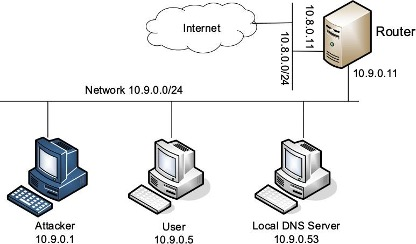
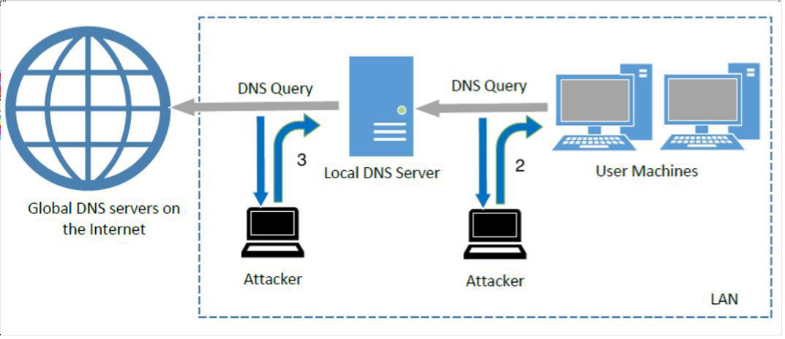

# ACIT 4630 – Lab 10 – DNS Spoofing

Please download and unzip Lab setup files in your SEED VM: 

[Labsetup-DNS.zip](files/Labsetup-DNS.zip)

Navigate to the folder where the `docker-compose.yml` file is and run `docker-compose up -d` to set up these machines:



- [BIND 9](https://bind9.net/) DNS server program is installed on the local DNS server.
- DNSSEC is introduced to protect against spoofing attacks on DNS servers. Since we want to demonstrate how these attacks affect a victim machine, we have turned DNSSEC off on the local DNS Server. Please verify this setting in `/etc/bind/named.conf.options` file
- Examine the content of `/etc/resolv.conf` file on the user container to verify that the IP of the local DNS server container is configured as its primary local DNS server
- The sniffing and spoofing inside containers are very slow, and sometimes our spoofed packets even arrive later than the legitimate ones from the Internet, even though we are local. To get around it we will intentionally slow down the traffic going to the outside, so the authentic replies will not come that fast. This can be done using the following `tc` command on the router to add some delay to the outgoing network traffic. The router has two interfaces, eth0 and eth1, make sure to use the one connected to the external network 10.8.0.0/24.

```sh
tc qdisc add dev eth0 root netem delay 100ms
#   Delay the network traffic by 100ms
```
**Note**: If at some point in the lab you need to empty the cache on the local DNS server, use:

```sh
rndc flush 
#   Flush the DNS cache
```

**Note**: If at some point in the lab you need to examine the cache on the local DNS server, use
```sh
rndc dumpdb -cache // Dump the cache to the file /var/cache/bind/dump.db
```
___Take screenshots of your code snippets and important results and explain what you see.___

Run **Wireshark** on the SEED VM (or Kali VM) before doing the tasks (select the correct interface based on the containers' network)

## Task 1: Modifying the Host File on the user machine

The hostname and IP address pairs in the HOSTS file `/etc/hosts` are used for local lookup; they take the preference over remote DNS lookups (We edited this file in the PKI lab to redirect users to visit the website hosted on our Apache server). It should be noted that the entries in the `/etc/hosts` file are ignored by the `dig` command, but will take effect on the ping command and web browser, etc.

Imagine you are the attacker and you have got access to the user's machine. If the user visits _www.google.com_ you want them to get redirected to your website which looks like google.com and is hosted on a machine with IP 1.2.3.4.

On the user container:

- Edit the /etc/hosts file and add an entry to map 1.2.3.4 to www.google.com.
- Ping www.google.com, and notice the destination address of the echo requests packets in Wireshark.
- Q1. Explain if the attacker did a spoofing attack in this task.
- Q2. What results will you get if you run `dig www.google.com`? Why?
- Q3. Why would a malware add entries to `/etc/hosts` file to map domains of many security vendors to the loopback address? (Example: Win32.QHOST Trojan)


## Task 2: Testing the DNS Setup
On the user container, use `dig` command to get the IP of `www.example.com`

1. Q4. How can you prove that your user machine is reaching out to the local DSN server container to find the IP of any hostname?
    - Hint: Look in the data returned by the dig command
2. Q5. In the answer section, there is a number for the answer (after the domain name). What does that number indicate?
3. Q6. Trace the route of the DNS packet (from your dig command) in Wireshark after you ran the `dig` command. 
4. Q7. Where is your local DNS server in that route? (provide screenshot)
What is the destination port of the packet that contains the original query?
5. Q8. Find the packet that contains the final response to the user container. What is the source IP of that? Why?
6. Q9. How is the packet route different in Wireshark if you run `dig www.example.com` for the second time (this should happen a short time after the first `dig` command)?

## Task 3: Spoofing Attacks over the network

The main objective of DNS spoofing attacks is to redirect the user to another machine B when the user tries to get to machine A using A’s hostname. For example, when the user tries to access online banking, if the adversaries can redirect the user to a malicious website that looks very much like the main website of the bank, the user might be fooled and give away the password of his/her online banking account.

**Note**: The attacks conducted in this lab assume that the attacker is on the same local network, and can thus sniff the DNS packets. This assumption is made to simplify the lab tasks.



### Task 3a: Directly Spoofing Response to the User (attack at point 2)

In this attack, we want to sniff a DNS query packet for www.bcit.ca from the user machine, and immediately send a fake DNS response back to the user machine. If the fake reply arrives earlier than the real reply from the local DNS server, it will be accepted by the user machine. 

Before sending any spoofed packet, let's understand the structure of a DNS packet in Scapy. Add the correct interface and filter to the provided Scapy code (`sniff-spoof-dns.py` in the volumes folder) and run it on the attacker machine to sniff any UDP request from the user machine to any DNS server (You need to provide the correct destination port for a DNS query). To trigger the code, run any `dig` command on the user machine (Don't dig bcit.ca yet - if you do flush the cache before doing the next step). Examine the different layers of the sniffed packet (IP, UDP, DNS) and the different properties of the DNS object.
```dns
id: Transaction ID; should be the same in the DNS Request and Response
qr: Query Response bit (0 means Request, 1 means Response)
aa: Authoritative answer (1 means that the answer contains Authoritative answer)
rd: Recursion Desired (0 means to disable Recursive queries)
qdcount: number of query domains.
ancount: number of records in the Answer section.
nscount: number of records in the Authority section.
arcount: number of records in the Additional section.
qd: Query Domain; should be the same in the DNS Request and Response
an: Answer section
ns: Authority section
ar: Additional section
```
After you understand different fields in the DNS layer of the sniffed packet, uncomment the `if` block in the Scapy code (remove `'''` ) and update it to send a spoofed DNS Response to the user machine. The fake IP attacker wants to send back is 5.6.7.8 (the machine with this IP hosts a website that belongs to the attacker and looks closely like the bcit.ca website). Run the python code on the attacker container and leave it running.

Run `dig www.bcit.ca` on the user machine to trigger the sniff and spoof code.

1. Q10. Do you get the correct response or the fake response in the `dig` results?
2. Q11. What happens if you run the `dig` command again immediately.  Do you get the correct response or the fake response in the `dig` results? Why? (Hint: Cache!)
3. Q12. Find the spoofed packet and the legitimate DNS answer in Wireshark for both `dig` commands. Notice which one got to the user machine faster in each case.
4. Q13. In this attack, the spoofed response is sent back directly to the user machine. Explain if this attack has affected the DNS cache on the local DNS server.

### Task 3b: Spoofing Response to the Local DNS Server - DNS Cache Poisoning Attack (attack at point 3)
We know that the local DNS server stores the answers it receives from other DNS servers in its cache, so next time (until the cache expires) if a user asks the same query, there is no need to ask other DNS servers. Therefore, if attackers can spoof the response from other DNS servers, the local DNS server will keep the spoofed response in its cache for a certain period of time. Next time, when a user’s machine wants to resolve the same hostname, it will get the spoofed response from the cache. This way, the impact of the attack will last longer (until the cached information expires), and it will potentially affect many users.

Before attacking, make sure that the local DNS Server’s **cache** is **empty**.

Update the same code you used in the previous task to sniff a DNS query for www.bcit.ca (UDP packet going to the DNS port) from the local DNS server and spoof a fake DNS response back to the local DNS machine.

Run `dig www.bcit.ca` on the user machine to trigger the sniff and spoof code.

- Q14. Do you get the correct response or the fake one from the `dig` command?
- Q15. Find the sniffed packet and both spoofed response and the legitimate DNS answer in Wireshark.
- Q16. What happens if you stop the attack and run the `dig` command?
- Q17. Is there any DNS request sent from the local DNS server? Why?
- Q18. How can you prove that the cache on the local DNS server is poisoned in this attack?
- Q19. How long will the cache stay poisoned?
- Q20. Will you get a spoofed response if you query the IP for www.google.com? Why?

Parts of the instructions are copied from [DNS Local Lab by seedsecuritylabs.org](https://seedsecuritylabs.org/Labs_20.04/Files/DNS_Local/DNS_Local.pdf)