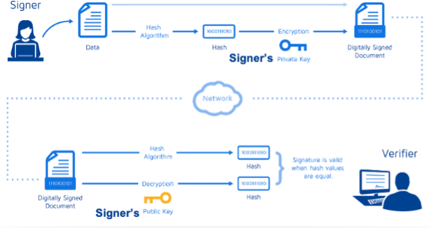

# ACIT 4630 – Lab 7 – Manually Verify an X.509 Certificate

## Instructions: 
When visiting a website, your browser does the verification of the website's public certificate. To better understand the process, we'll do manual verification of the certificate that www.bcit.ca provides. To verify a certificate, we need to verify the Certificate Authority's (CA) signature on it. To verify a digital signature, we need the signer's public key to decrypt the provided signature and compare it with the hash of the signed document. 



Recommended VM is SEED VM but if you want to use any other VM such as Kali, make sure you have OpenSSL installed.
```sh
openssl s_client -showcerts -connect www.bcit.ca:443
```
Copy and paste each of the certificates (the text between the line containing `BEGIN CERTIFICATE` and the line containing `END CERTIFICATE`, including these two lines) into a c0.pem (for the first one) and c1.pem (for the second one). 

Q1 Who is the issuer of the two certificates? 

### Decrypt CA's signature 
We need CA's public key to decrypt its signature on BCIT website's certificate. To vouch for its public key, the CA provides a certificate signed by another authority. On the certificate, it's mentioned that the RSA algorithm is used for the signature. So, we will be using the same C code we used in lab5 to decrypt this signature. 

Extract the following values from the CA's certificate (`c1.pem`) to get its public key: 
- This should give you the modulus which is used as n in the code:
    ```sh 
    openssl x509 -in c1.pem -noout -modulus 
    ```
- This should give you the public key which is used as e in the C code:
    ```sh 
    openssl x509 -in c1.pem -text -noout | grep "Exponent" 
    ```
- Extract the CA's signature from the server’s certificate (`c0.pem`). Print out all the fields in the certificate and then copy and paste the signature field (the last block in the printed text) into a file called signature.
    ```sh
    openssl x509 -in c0.pem -text -noout
    ```
- We need to remove the spaces and colons from the data, so we can get a hex string that we can feed into our C program. The following command can achieve this goal. The tr command is a Linux utility tool for string operations. In this case, the `-d` option is used to delete `:` and `space` from the data. 
    ```sh
    cat signature | tr -d '[:space:]:' 
    ```
- We'll use this value to initialize the ciphertext in the C code.
- You need to uncomment and update appropriate lines in the C code to decrypt this signature.
- Reminder: To compile the code use 
    ```sh
    gcc -o rsa rsa.c -lcrypto
    ```
- and then run `./rsa` to see the CA's signature decrypted. 

### Compute the certificate's hash 
Now we need to extract the body of the server's certificate and compute its hash to compare to the decrypted signature. Since the hash is generated before the signature is computed, we need to exclude the signature block of a certificate when computing the hash. This command will give us that (if you are interested in understanding where this comes from check out this [SEED lab instruction](https://seedsecuritylabs.org/Labs_20.04/Files/Crypto_RSA/Crypto_RSA.pdf):
```sh
openssl asn1parse -i -in c0.pem -strparse 4 -out c0_body.bin -noout
```
Since it's mentioned that sha256 hash was used to create the signature, we'll use the following command to calculate the hash from the certificate body:
```sh
sha256sum c0_body.bin
```

S1. Provide screenshots showing that the decrypted signature ends in the hash calculated in the previous step.
Note: The hash value was extended to RSA key size by prefixing padding before getting encrypted.

Q2. What data does such a certificate contain?

Q3. List the steps to manually verify that an X.509 certificate is authentic.

Q4. If we only get one certificate after running the following command, what does that mean? where would we find the issuer's public key?
```sh
openssl s_client -showcerts -connect www.bcit.ca:443
```

### Submission For Lab 8:
- Create a report answering any questions in the lab above and including any required screenshots.
- Submit your report to the Learning Hub in PDF format.
