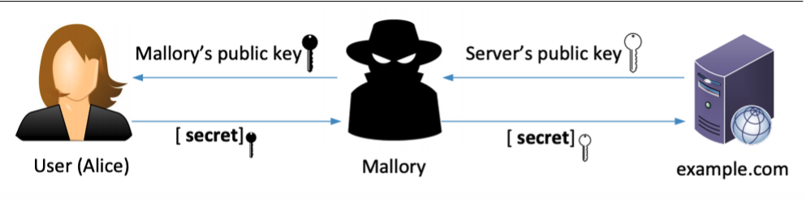

# ACIT 4630 – Lab 6 – Public Key Infrastructure (PKI)

NOTE: This lab will be done on Kali Linux
The instructions are adapted from [seedsecuritylabs.org](https://seedsecuritylabs.org/Labs_20.04/Files/Crypto_PKI/Crypto_PKI.pdf)

## Instructions: 
Public key cryptography is the foundation of today's secure communication, but it is subject to man-in-the-middle attacks when one side of communication sends its public key to the other side. The fundamental problem is that there is no easy way to verify the ownership of a public key, i.e., given a public key and its claimed owner information, how do we ensure that the public key is indeed owned by the claimed owner? The Public Key Infrastructure (PKI) is a practical solution to this problem. 

The learning objective of this lab is for you to gain first-hand experience on PKI. We will set up an HTTPS web server for our chosen domain (you do not need to own the domain). The domain name should contain your first name/last name and 2025. For example, if I was in your group this could be my domain name: www.imananoosheh2025.info

### Task 1: Becoming a Certificate Authority (CA) 
A Certificate Authority (CA) is a trusted entity that issues digital certificates. The digital certificate certifies the ownership of a public key by the named subject of the certificate. Several commercial CAs are treated as root CAs; DigiCert is the largest CA at the time of writing. Users who want to get digital certificates issued by the commercial CAs need to pay those CAs.

In this lab, we need to create digital certificates, but we are not going to pay any commercial CA. We will become a root CA ourselves, and then use this CA to issue certificates for others (e.g. servers). In this task, we will make ourselves a root CA, and generate a certificate for this CA. Unlike other certificates, which are usually signed by another CA, the root CA’s certificates are self-signed. Root CA’s certificates are usually pre-loaded into most operating systems, web browsers, and other software that rely on PKI. Root CA’s certificates are unconditionally trusted.

The Configuration File `openssl.cnf`. To use OpenSSL to create certificates, you must have a configuration file. The configuration file usually has an extension `.cnf`. It is used by three OpenSSL commands: ca, req and x509. The manual page of `openssl.cnf` can be found from online resources.

By default, OpenSSL uses the configuration file from `/usr/lib/ssl/openssl.cnf`. Since we need to make changes to this file, we will copy it into our current directory, and instruct OpenSSL to use this copy instead. 

1.	**Prepare the Environment:** 
Copy the OpenSSL configuration file (`openssl.cnf`) from its default location (`/usr/lib/ssl/`) to your current working directory. This allows you to modify the file without affecting the system-wide OpenSSL configuration. 
2.	**Edit the Configuration File:** 
In the openssl.cnf file, find the `[ CA_default ]` section and uncomment the `unique_subject` line and set it to no, allowing multiple certificates with the same subject. 
3.	**Create Necessary Directories and Files:** 
    - Create a directory structure as specified by the dir variable in your openssl.cnf file. We need to first create the `demoCA` directory. Navigate to that directory. Then, create the following directorys: `certs`, `crl`, `newcerts`
    - Create an empty file named `index.txt`
    - Create a file named serial and put a single number (e.g., `1000`) in it. This number is used as the starting serial number for issued certificates. 
4.	Generate the CA Certificate: 
    - Go back to the working directory (where the `openssl.cnf`) is.
    - Run the following command to generate a new RSA private key and a self-signed certificate for your CA: 
        ```sh
        openssl req -x509 -newkey rsa:4096 -sha256 -days 3650 -keyout ca.key -out ca.crt -subj "/CN=www.modelCA.com/O=Model CA LTD./C=CA" -passout pass:dees
        ```
    
        This command creates `ca.key` (**private key**) and `ca.crt` (**self-signed certificate**). The `-subj` option provides subject information for the certificate directly in the command line, avoiding interactive prompts.

        **Note**: `www.modelCA.com` is the CA’s domain, don't confuse this with your webserver domain. 

5.	Verify the CA Certificate:
    - Use `openssl x509 -in ca.crt -text -noout` to display the X509 certificate's content.
    - Use `openssl rsa -in ca.key -text -noout` to display the private key's content.

- Q1. What part of the certificate indicates this is a CA’s certificate?
- Q2. What part of the certificate indicates this is a self-signed certificate? 


### Task 2: Generating a Certificate Request for Your Web Server 
A company called imananoosheh2025.info (replace this with the name of your own web server) wants to get a public key certificate from our CA. First it needs to generate a Certificate Signing Request (CSR), which basically includes the company’s public key and identity information. The CSR will be sent to the CA, who will verify the identity information in the request, and then generate a certificate. The command to generate a CSR is quite like the one we used in creating the self- signed certificate for the CA. The only difference is the -x509 option. Without it, the command generates a request; with it, the command generates a self-signed certificate. 

To allow a certificate to have multiple names, the X.509 specification defines extensions to be attached to a certificate. This extension is called Subject Alternative Name (SAN). Using the SAN extension, it’s possible to specify several hostnames in the `subjectAltName` field of a certificate. We will use this option to add two alternative names to our certificate signing request. They will be needed in the tasks later. 

1.	**Generate the Server Key and CSR:**
Run the following command to generate a new RSA private key and a CSR for your server: 
```sh
openssl req -newkey rsa:2048 -sha256 -keyout server.key -out server.csr -subj "/CN=www.imananoosheh2025.info/O=Your Organization/C=CA" -passout pass:dees -addext "subjectAltName = DNS:www.imananoosheh2025.info, DNS: www.iman.ca, DNS:www.iman.io" 
```
Note: Replace the domain (iman.info) and Your Organization with your actual server’s name and organization. Also, replace the alternative domains (iman.ca and iman.io) with your alternative domains. 

2.	Verify the CSR:
    - Use `openssl req -in server.csr -text -noout` to review the details of the CSR.
    - Use `openssl rsa -in server.key -text -noout` to verify the private key. 

- Q3. What is your web server name? What other alternative names did you add to your certificate signing request?

- Q4. List the steps for a web server to get a public-key certificate from a CA? 

- Q5. If this were a real-world scenario, how would you submit the CSR to a Certificate Authority (CA)?


### Task 3: Generating a Certificate for your server 
The CSR file needs to have the CA’s signature to form a certificate. In the real world, the CSR files are usually sent to a trusted CA for their signature. In this task, we will use our own trusted CA to generate certificates. 

1.	Adjust Configuration to Copy Extensions: 
For security, OpenSSL's default configuration does not copy extensions (e.g. SANs) from the CSR to the certificate. To enable that, we can go to our copy of the configuration file, uncomment the following line: 
Find and uncomment the `copy_extensions` line in your CA's OpenSSL configuration file (`openssl.cnf`), setting it to copy. 
2.	Sign the CSR to Generate the Server Certificate:
The following command turns the certificate signing request (`server.csr`) from task 2 into an X509 certificate (`server.crt`), using the CA’s `ca.crt` and `ca.key`: 
```sh
openssl ca -config openssl.cnf -policy policy_anything -md sha256 -days 3650 -in server.csr -out server.crt -batch -cert ca.crt -keyfile ca.key
```
3.	Verify the Server Certificate:
Use the following command to print out the X509 certificate issued for our webserver: `openssl x509 -in server.crt -text -noout` 

- Q6. Who is the issuer of this certificate? What part of the certificate indicates this? 
- Q7. Can the certificate generated in this step be used to sign other certificates. What part of the certificate indicates this? 
- Q8. How long is this certificate valid for? Where in the OpenSSL command did we indicate this? 

### Task 4: Deploying Certificate in an Apache-Based HTTPS Website 
In this task, we will explore how public-key certificates are utilized by websites to secure web browsing. We will set up an HTTPS website using Nginx, which is installed directly on Kali Linux. To create an HTTPS website, we need to configure Nginx to specify the locations of the private key and certificate.

Container Setup and Commands. Please **download**, unzip, and enter the [Labsetup](files/Labsetup-PKI.zip), and use the `docker-compose.yml` file to set up the lab environment. Navigate to `image_www` directory and do the following:
- Copy your webserver's key and certificate (originated in Task 3 and 4) to the cert directory.
- Update the `mywebsite_apache_ssl.conf` and add your webserver domains and alternate names (to `ServerName` and `ServerAlias`) in both `:443` and `:80` entries.
- **Note**: The SSLEngine, SSLCertificateFile, SSLCertificateKeyFile directives don't mean
that we are using the SSL protocol. We could choose what protocol our server is using in the webserver configurations. PKI certificates don't depend on what protocol is being used.

Now navigate to the directory containing the `docker-compose.yml` file and run the following command to set up the container.
```sh
docker-compose up -d
```
The Apache server is not automatically started in the container, because of the need to type the password to unlock the server's private key. You need to get a shell in the container and run the following commands to start, stop, or restart the server:
```sh
service apache2 start
service apache2 stop
service apache2 restart
```
Examine these commands ([Commands Commonly Used in SEED Labs](https://github.com/seed-labs/seed-labs/blob/master/manuals/docker/docker-commands.md)) to help you run a specific command in a container. 

#### DNS Setup:
Since you are trying to set up an HTTPS webserver for the domain you don't really own, we will map your chosen domain and all the alternate names you used in the CSR to the container’s IP address (Verify the container's IP address). you would add this entry to `/etc/hosts` file on the VM to redirect any visit to the chosen domains to the webserver running in the container:
```txt
10.9.0.80 <your domain address>
10.9.0.80 <an alternate for your domain address>
10.9.0.80 <another alternate for your domain address>
```
After you started the Apache server and updated the `/etc/hosts` file, try navigating to both HTTP and HTTPS versions of your website on the browser on the VM.

- Q9. You should see a warning if you navigate to your HTTPS website. Click on Advanced and explain what you see and why.
 
- Q10. Explain how you can fix this error and provide a screenshot that you can successfully browse the HTTPS website without getting a warning (for the main domain and the alternative domains)
    - Hint: You need to load a certificate to your browser. To manually add a certificate to the Firefox browser, type `about:preferences#privacy` in the address bar, and click the View Certificates button on the page (scroll to the bottom) In the Authorities tab, you will see a list of certificates that are already accepted by Firefox. From here, we can import our own certificates. After choosing the certificate file, please select the following option: “Trust this CA to identify web sites”. You will see that our certificate is now in Firefox’s list of accepted certificates.

- Q11. On the container, navigate to `/etc/apache2/sites-available` and add the following entry to the field for the HTTP connection in `mywebsite_apache_ssl.conf` file that was copied there when you ran the container. Restart the server and provide a screenshot to show that all coming traffic will be directed to the HTTPS version.

```txt
Redirect permanent / https://<yourdomain>.com 
```
- Hint: use `curl` command to show the redirect.

### Task 5: Launching a Man-In-The-Middle Attack

In this task, we will demonstrate how PKI can prevent Man-In-The-Middle (MITM) attacks. Assume Alice wants to visit `imananoosheh2025.info` via HTTPS. She needs to get the public key from the `imananoosheh2025.info` server. If an attacker can intercept the communication between Alice and the server, the attacker can replace the server’s public key with its own public key. Therefore, Alice’s secret is encrypted with the attacker’s public key, so the attacker will be able to read the secret. The attacker can forward the secret to the server using the server’s public key. The secret is used to encrypt the communication between Alice and server, so the attacker can decrypt the encrypted communication.



In this task, we will emulate an MITM attack and observe how PKI can counteract it. We will select a target website first. In this document, we will use www.`imananoosheh2025.info` as the target.
In Task 4, we have already set up an HTTPS website. To impersonate www.`imananoosheh2025.info`, follow these steps:

- Add this entry to `/etc/hosts` on the VM:
    ```txt
    10.9.0.80 www.imananoosheh2025.info
    ```
- On the container, navigate to `/etc/apache2/sites-available` and add the following entry in the `mywebsite_apache_ssl.conf` file:
    ```txt
    ServerAlias www.imananoosheh2025.info
    ```
- Now restart the Apache server.

- (Q12) Explain what warning you will see when navigating to `https://www.imananoosheh2025.info`/ on the VM.


### Submission For Lab 6:
- Create a report answering any questions in the lab above including required screenshots.
- Submit your report to the Learning Hub in PDF format. 