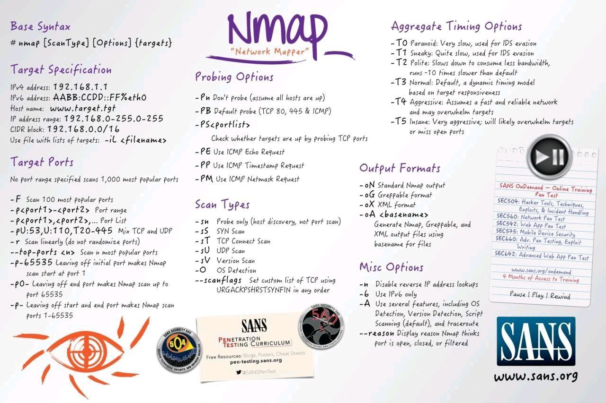

# ACIT 4630 – Lab 1 – Setup Kali Linux and Metasplotable 2

### Note: 
You may optionally work with a partner for the labs in this course. Make sure you submit your own-written report of your lab, since the lab submission is individual.


Note For Apple Machines with M series:
- Instead of Virtual Machine you must use of of below options:
    - Download the UTM App
        - [UTM | Virtual machines for Mac (getutm.app)](https://getutm.app/)
    - Download VMware Fusion Pro
        - [Link](https://blogs.vmware.com/teamfusion/2024/05/fusion-pro-now-available-free-for-personal-use.html)

### Instructions
**Kali Linux** is an advanced penetration testing Linux distribution that comes with lots of security tools preinstalled. Download a VM image for Kali Linux and set up a VM machine for it https://www.kali.org/get-kali/#kali-virtual-machines
- Make sure the VM's network is a NAT network
- Login to the VM. username: kali password: kali
- Explore different tools on Kali Linux.
- (Q1) How can you find this machine's IP?
- Find Metasploit (https://www.offensive- security.com/metasploitunleashed/introduction/) and run it from the Applications menu. You should see msfconsole open. Almost all of your interaction with Metasploit will be through its many modules, which we explore more next week.

**Metasploitable 2**, is an intentionally vulnerable Ubuntu (64-bit) Linux virtual machine that is designed for testing common vulnerabilities.
- Download a VM image for metasploitable 2 and set up a VM machine for it
- https://sourceforge.net/projects/metasploitable/

Note for MacOS with M series Chip:
1. Download and Install the HomeBrew
2. InstallQEMU
    ```sh
    brew install qemu
    ```
3.	Convert the .vdmk file to .QCOW2 (QEMU Image)
    ```sh
    qemu-img convert -f vmdk -O qcow2 vmName.vmdk vmName.qcow2
    ```
4.	Load the .QCOW2 file to UTM App

Note for Windows 11 Users using VirtualBox:
-	You might face a Kernel Panic with Metasploitable 2; here are steps for workaround:
    -	Turn of the MetaSploitable 2 VM machine
    -	Run below commands in the PowerShell:
        ```powershell
        vboxmanage modifyvm <uuid|vmname> --acpi off
        vboxmanage modifyvm <uuid|vmname> --ioapic off
        ```
-	Make sure the VM's network is the same NAT network as Kali VM's
-	Login to the VM. username: msfadmin, password: msfadmin
-	(Q2) How can you find this machine's IP?
    - Note: If you're getting the same IP as the Kali Linux machine you need to change the network to a NAT network
-	(Q3) Get yourself familiar with nmap command and its different options. How can you find this machine's OS as well as the services and their software versions running on open ports on this machine from your Kali VM?
-	
-	https://nmap.org/book/man.html
-	[Nmap Tutorial to find Network Vulnerabilities (YouTube)](https://youtu.be/4t4kBkMsDbQ?si=EtiqpWknYs2GBDH_)
-	[Introduction to NMAP for Beginners! (YouTube)](https://youtu.be/NYgDzO8iQJ0?si=NcbmoceDVjTYUAM8)
    - Hint: If you cannot see any port open on this machine from the Kali machine double-check the NAT network
- (Q4) What's the use case when we need to use -Pn probing option with nmap?
    - Hint: try nmap google.com
        - The server is live on the internet, and ready for you to probe even though running above command might tell you differently.

### Prep for Lab 2:
Please install the OpenVAS software on you Kali VM before the week 2 class.
```sh
??? needs update

sudo apt update
sudo apt upgrade -y
sudo apt dist-upgrade -y

sudo apt install openvas

sudo gvm-setup

gvm-check-setup

```

### Submission For Lab 1:
- Demonstrate your running VMs above to your instructor.
- Take screenshots of your running VMs and answers to the questions in the lab. 
- Craft a report including the screenshot and your observations and the answers to the questions. 
- Submit your report to the learning hub.