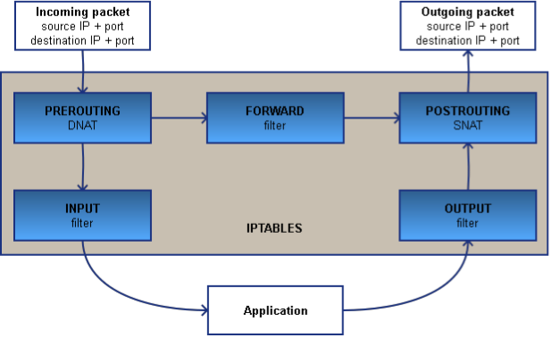

# ACIT 4630 – Lab 8 – Firewall Exploration

## Instructions: 
Please download and unzip [Labsetup-Firewall](files/Labsetup-Firewall.zip) files in your SEED VM or Kali VM.

Now navigate to the folder containing the `docker-compser.yml` file and run the following command: 
```sh
docker-compose up -d
```
to setup these machines: 


- 192.168.60.0/24 network is our internal network
- 10.9.0.0./24 acts as the external network

Note: Since we will be running multiple containers, feel free to use bash_alias to code shorter commands. Some examples:


You may also eb able to rename your Terminal Tabs to easily find the container you want to use:


_For each part below, take screenshots of your code snippets and important results and explain what you see._
 
## Part 1 - Experimenting with Firewall Rules 
The default firewall configuration tool for Ubuntu is [ufw](https://help.ubuntu.com/community/UFW). Developed to ease iptables firewall configuration, ufw provides a user-friendly way to create an IPv4 or IPv6 host- based firewall. 
ufw by default is initially disabled. But there might still be some rules set in Netfilter kernel firewall on Linux. Check the firewall default policies on the router container by using `iptables -L` 

### Task 1a - ufw exploration 

- From the hostA-10.9.0.5 container, telnet to the router machine 
- From the router container, telnet to the hostA machine
    - Q1. What happens? Do you expect both commands to work? 
- On the router container, run `ufw enable` to turn on the firewall on the router machine. 
- Run both telnet commands again and notice if anything is different from before. 
- Q2. Run `ufw` status verbose and based on the Default values in the results, explain what happened in the previous step.
- Note: You can also see the default rules in `/etc/default/ufw` file 

In the next steps, we are going to add some rules to the firewall. Rules added via `ufw` get translated to iptables rule format and stored in `user.rules` in `/etc/ufw folder`. You can also see `before.rules` and `after.rules` files in this folder. ufw will run rules in these files before and after any added rule through the command line. 
    - Q3. By default, ufw allows `ping` requests so we didn't use the `ping` command for our exploration earlier. Find the rules that allow ping requests in `/etc/ufw/before.rules` 

### Task 1b - Allow hostA to telnet to router 
Use the following command to add a rule to allow hostA to telnet into the router: 
```sh
ufw allow from <target> to <destination> port <port number>
```
- Run `ufw` status to see the added rule. 
- Note: To add a more general rule you can omit from/to and only include port or service name (e.g. `ufw allow ssh` or `ufw allow 22`) 
- Note: To delete a rule, you have two options:
    - Repeat the rule and add `delete` before the rule implementation (e.g. `ufw delete allow 22`) - this option has the benefit of deleting both ipv4 and ipv6 (if they both exist)
    - Run `ufw status` numbered and `ufw delete <rule number>`
- Note: If you want to turn off ufw completely and delete all the rules, you can use `ufw reset`. You can start it again using: `ufw enable`

### Task 1c - Add routing rules between hostA and internal network 
- Telnet from hostA into one of the machines in the internal network 192.168.60.0/24.
    - Q4. Do you expect it to work? Why? 
- Telnet from one of the machines in the internal network 192.168.60.0/24 into hostA.
    - Q5. Do you expect it to work? Why?
    - Hint: check the default policies via `ufw status` verbose
- Let's add a routing rule to allow the internal network telnet to any computer in the outside network (10.9.0.0/24). This is the command you could use to add a **routing rule** (use `ifconfig` to find the correct interface names on the router container, e.g. `eth0`, `eth1`,...):
    ```sh
    ufw route allow in on <interface1> out on <interface2> to <network/IP> port <number> 
    ```
    - This will allow all traffic coming in on `<interface1>` to traverse the firewall and be routed to the `port <number>` of `<network/IP>` on `<interface2>`
    - Note: To delete a routing rule, if you want to repeat the rule with the `delete` keyword you need to add it after route (e.g. `ufw route delete allow in ...`)
    - Run `ufw status` to see the added rule.
- Q6. Show that you can telnet to the outside network from any machine in the internal network after the rule is added.

- Now add another routing rule to allow only hostA to telnet to host3-192.168.60.7 machine only (not other internal hosts).
    - Hint: Pay attention to the interface names in the rule
    - Note: You need to add from `<IP>` to the route rule
    - Run `ufw status` to see the added rule
    - Q7. Show that you can only telnet from hostA to host3 and not other machines in the internal network. 

### Task 1d - Stateless or stateful? 
Let's explore if ufw is a stateless or a stateful firewall. A stateless firewall treats packets independently and does not take into consideration the context of the packets, and can thus lead to inaccurate, unsafe, or complicated firewall rules. In contrast, a stateful firewall uses a connection state table to maintain some state information for each connection and allows traffic that belongs to an existing connection

- Run one of the telnet commands that's allowed based on your previous rules. 
- [conntrack](https://man.cx/conntrack(8)) is a core feature of the Linux kernel that provides connection tracking. Check the connection tracking information on the router container using
```sh
conntrack -L
```
- Each connection tracking entry contains defined characteristics of the packet, including the source and destination IP address and port numbers in the two directions (the original direction and the expected response), and the state (New, Established, Related, Invalid) of the connection. The second number you see in each entry is the time in seconds after which the connection tracking entry expires.
    - Note: The ASSURED flag in an entry tells us that this connection has seen traffic in both directions
- Check the size of the connection state table maintained by `conntrack` by running `cat /proc/sys/net/netfilter/nf_conntrack_max`
    - Q8. What happens to a new incoming connection if this table gets filled up?
    - Note: The ASSURED flag in an entry means that it will not be deleted if we reach the maximum possible tracked connection. (When the number of connections reaches the maximum, the system begins to delete not assured connections to free up some space)
- Explore the content of `/etc/ufw/before.rules` (ufw will run all rules in this file before any added rule through the command line) and see if you can find rules showing that ufw is a stateful firewall.
    - Note: the `-m` conntrack option indicates the use of conntrack **module**
- Q9. What are some advantages and disadvantages of stateful filtering compared 
to stateless filtering? 


## Part 2 – Experimenting with Network Address Translation (NAT) 

### Task 2a - Source NAT (SNAT) 

SNAT (Source NAT) can be used to change the source address/port in the IP header of a packet before it leaves the system (e.g. to the internet). In this task, we will experiment with IP Masquerading (a variant of NAT where the public source IP is assigned dynamically) in the Linux kernel that translates the network traffic by re-writing the source and destination IP addresses and port. 
- Q10. Before enabling NAT, let's see if we can reach any website on the internet from host1 in the internal network (192.168.60.0/24). For example, try
ping www.google.com. Explain what you observe. 

To use ufw to do network address translation (IP masquerading), you need to first

- Enable IP forwarding: Find and uncomment the line which reads `net/ipv4/ip_forward = 1` in this file:`/etc/ufw/sysctl.conf`
- Configure ufw to allow forwarded packets:
Find `DEFAULT_FORWARD_POLICY` key in `/etc/default/ufw` file and change the value from `DROP` to `ACCEPT` 

Next, you need to add the masquerade rule for the POSTROUTING chain (chain is a series of rules) in the nat table



- We can't use ufw command line to add this rule, so we will edit
the `/etc/ufw/before.rules` file. The default rules in .rules files only configure the filter table, and to enable masquerading the nat table will need to be configured. Add the following to the top of the file just after the header comments:

    ```sh
    #NAT table rules
    *nat
    :POSTROUTING ACCEPT [0:0]
    # Forward traffic from the <network Range/IP> through <the public network interface>
    -A POSTROUTING -s <network address> -o <public interface> -j MASQUERADE 
    # don't delete the 'COMMIT' line or these rules won't be processed
    COMMIT 
    ```
- Finally, disable and re-enable ufw to apply the changes: 
    ```sh
    ufw disable && ufw enable
    ```
- Check that the masquerade rule is added: `iptables -t nat -L -v `
- Note: If you need to delete all the rules in the nat table: `iptables -t nat -F` 

- Q11. Show that you are able to ping any website on the internet from the private network now. 
- Linux uses Connection Tracking (conntrack) to keep track of which connections belong to which machines and reroute each return packet accordingly. After you are successfully able to ping an external website, run `conntrack -L` and note the `src` and `dst` for the original direction and the expected response in the entry related to the `icmp` connection. 
- Q12. What problem does Network address translation solve? 
- Q13. What are some security concerns with NAT? 


### Task 2b - Destination NAT (DNAT) 
Destination NAT (DNAT) changes the destination address/port in the IP header of an incoming packet. 

- Q14. Port forwarding: Imagine we have a web server running on port 80 on host1 in the internal network (which is inaccessible from outside). Explain how the following command (which would be added to *nat table in `before.rules` file) uses DNAT to make the webserver accessible to the users on the internet) (You don't need to add the command) 
```sh
-A PREROUTING -i eth0 -p tcp --dport 8000 -j DNAT --to- destination 192.168.60.5:80
```
 
### Submission For Lab 8: 
- Create a report answering any questions in the lab above and including any required screenshots. 
- Submit your report to the Learning Hub in PDF format.
