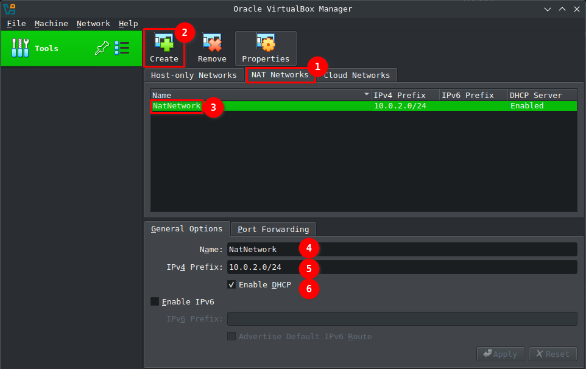
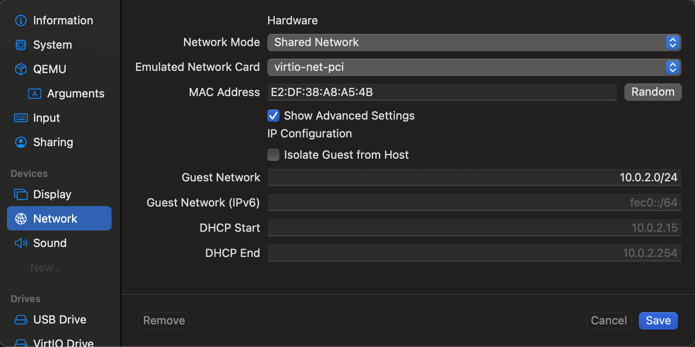
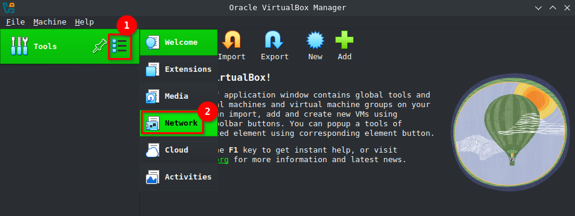
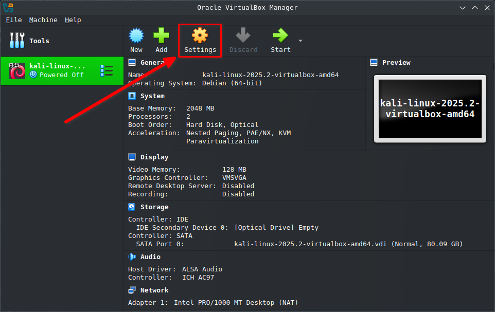
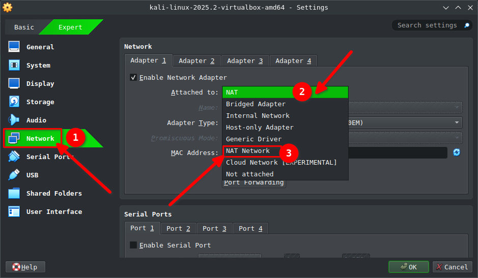
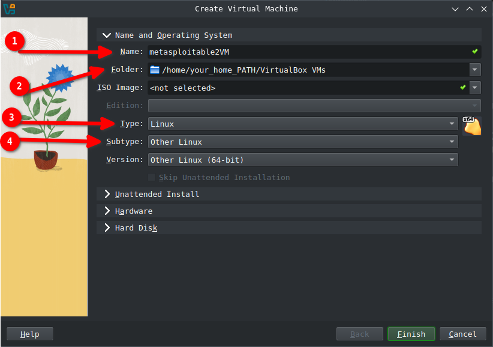
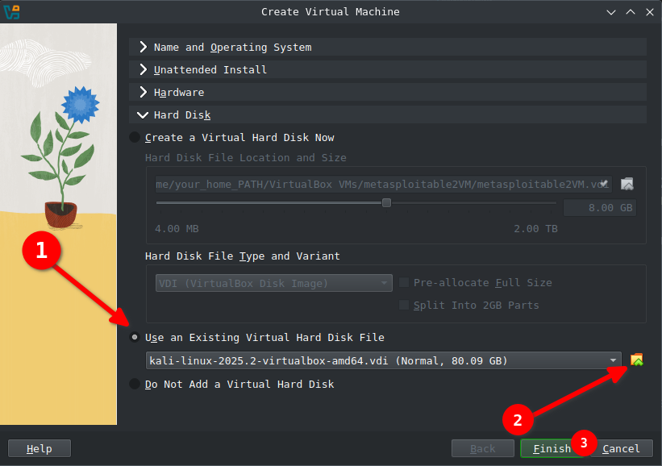
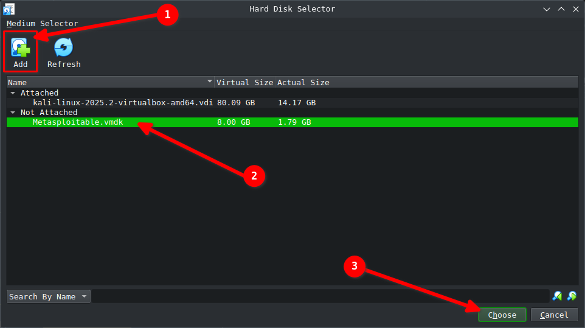

# ACIT 4630 – Lab 1 – Setup Kali Linux and Metasplotable 2

> **Note:**
>
> * You may optionally work with a partner for the labs in this course.
> * Lab submissions are **individual**. Write your own report with your screenshots, answers, and observations.

---

## 1. Choose Your Virtualization Software

You will run two virtual machines (VMs): **Kali Linux** (attacker) and **Metasploitable 2** (target).
Which software you use depends on your computer:

* **Windows / Linux / Intel-based macOS:** Use **VirtualBox**

    👉 [Download VirtualBox](https://www.virtualbox.org/wiki/Downloads)

* **Mac with Apple Silicon (M1/M2/M3/M4):** Use **UTM**

  👉 [Download UTM](https://mac.getutm.app/)

  ⚠️ VirtualBox does **not** work with Apple Silicon.

---

## 2. Setting Up the Network

Both Kali and Metasploitable **must be** on the same virtual network so they can communicate.

### VirtualBox (Intel/AMD users)

1. Open VirtualBox → **Preferences** → **Network** → Switch to **Expert Mode**.

2. Create a **NAT Network**:

   * Name it `IASNetwork`
   * Make sure **DHCP is enabled**
   * Leave the default IP range unchanged

   

3. Each VM must use this `IASNetwork` as its adapter. (You’ll set this when configuring each VM below.)

---

### UTM (Apple Silicon users)

1. After setting up each VM, **Edit** each VM → **Devices** → **Networks**
2. Set the **Network Mode** on **Shared Network** (similar to NAT in VirtualBox).
3. Check **Show Advanced Settings**, Set the **Guest Network** to `10.0.2.0/24`
    
4. For **Emulated Network Card**, it shouldn't matter which Network Card you choose, but for consistancy choose one Network Card for both VMs.
5. Ensure **both Kali and Metasploitable VMs are attached to the same Shared Network**.

   * Name the network `IASNetwork` for consistency.

---

## 3. Install Kali Linux

### VirtualBox (Intel/AMD users)

#### Download a Kali VM image (prebuilt `.vbox`)

👉 [Kali Virtual Machines](https://www.kali.org/get-kali/#kali-virtual-machines)

 - **Note:** If download speed is low, feel free to download via torrent, don't worry it is legal! 😎

#### In VirtualBox → **Machine → Add** → select the extracted `.vbox` file.

#### Create a Virtual Network type NAT

1. Initially we need to make sure our VirtualBox is on Expert mode! This could be changed either on the welcome page (the first page that appears) or in preferences, could be toggled from top tabs.

2. After swithed on expert mode, click on the tools options:

    

3. Follow the steps 1 and 2 to create a NAT Network

    

    3. In step 3, you can double click on the NAT created to modify if needed.
    4. Feel free to rename your NAT to `IASNetwork`
    5. Here we can change the range of clients and sub-network we can later create which we do not change as of now.
    6. **Important!** make sure DHCP is checked/enabled!

#### Install Kali Linux

**Kali Linux** is an advanced penetration testing Linux distribution that comes with lots of security tools preinstalled.

**Instructions:**
Download a VM image for Kali Linux and set up a VM machine for it [https://www.kali.org/get-kali/#kali-virtual-machines](https://www.kali.org/get-kali/#kali-virtual-machines)

**Note:** If download speed is low, feel free to download via torrent, don't worry it is legal! 😎

- After Extracting the compressed file, from the top menu in VirtualBox, choose Machine -> Add, then search for where you have extracted your Kali machine and choose the `.vbox` file.
- **important!** Before you start the Kali machine for the first time we need to make sure that its network is set on the NAT we previously created.
- To change the Network settings of our virtual machine (Kali) we need to hit Settings.

    

- From the left panel choose Network, Click on *Attached to:* drop down menu and choose **NAT Network**

    

- Choose the custom NAT you just created above. `IASNetwork`
- Login to the VM. username: `kali` password: `kali`

---

### UTM (Apple Silicon users)

⚠️ Prebuilt Kali VM images **do not work on Apple Silicon**.
You must install Kali manually.

1. Download the **ARM64 installer ISO**:
   👉 [Kali Linux ARM64 Installer](https://www.kali.org/get-kali/#kali-bare-metal)
2. In UTM → Create a new VM:

   * Select **Virtualize → Linux**
   * Use the downloaded ARM64 ISO
   * Allocate at least **2 CPU cores** and **4 GB RAM**
   * Attach to the `IASNetwork` you created
3. Fixing the black screen issue:

   * Go to the VM’s **Settings** by hitting **Edit** → **Devices**
   * Add a **Serial** device
   * Leave the Mode set to **Built-in Terminal**
   * Save settings and start the VM again

4. Boot and follow the installer prompts.

   * Set your own username/password.

---

## Post Kali Installation

- Open the Termianl and Change your Kali machine's hostname to a name unique to you:

```sh
hostnamectl hostname for-example-iman-a
```

Also you should replace the exact same name which you just chose as your hostname in `/etc/hosts` file with `kali`

```sh
sudo nano /etc/hosts
```

```plaintext
127.0.0.1       localhost
127.0.1.1       for-example-iman-a
```

### First App to discover: Metasploit

Find Metasploit [(Doc page)](https://www.offsec.com/metasploit-unleashed/introduction/) and run it from the Applications menu. You should see `msfconsole` open. Almost all of your interaction with Metasploit will be through its many modules, which we explore more next week.

---

## Install Metasploitable 2 Virtual Machine

**Metasploitable 2**, is an intentionally vulnerable Ubuntu (64-bit) Linux virtual machine that is designed for testing common vulnerabilities.

- Download a VM image for metasploitable 2 and set up a VM machine for it

- [Download Metasplotable 2 VM Here](https://bcit365-my.sharepoint.com/:u:/g/personal/iman_anooshehpour_bcit_ca/EY4Bw_6nCs5Jv4-rsNCy2JQBqfJSNn5_hEr-zGPwceQQqg?e=XANe8I)

### Install Metasploitable 2 (Apple Silicon users)

[Important for Mac Users] => If you have a Mac which has M series Chip:

**If you don't have a Mac with M Series Chip, you should skip this section and start from Metasploitable 2 Installation**

since you CPU architecture is different (arm64) in compare to others (which most probably is amd64) you need to convert this virtual machine's file to work on your CPU architecure. Here is how:

1. Download and Install the HomeBrew
2. InstallQEMU

    ```sh
    brew install qemu
    ```

3. Convert the .vdmk file to .QCOW2 (QEMU Image)

    ```sh
    qemu-img convert -f vmdk -O qcow2 Metasploitable.vmdk Metasploitable.qcow2
    ```

4. Load the .QCOW2 file to UTM App

---

### Metasploitable 2 Installation

This is installation might be a little tricky! but don't worry i got you covered. if we take a look inside the .zip file, we will see bunch of files. the most important one that we need to work with is `Metasploitable.vmdk`. `.vmdk` file is a Virtual Disk, meaning the metasploitable VM is already installed on it we just need to attach it and boot it up. here is how:

1. In our VirtualBox instead of clicking on Add we will press **New**. we can also do so from the top menu => Machine => New.
2. Choose a name for your VM. It's recommanded that you choose the same decompressed directory which includes `.vmdk` file. Choose the Type to be Linux and Subtype to be Other Linux.

    

3. We will jump to the last section *Hard Disk*. Since we have the Disk ready we just need to find it and attach it to this VM instance that we are creating.

    

4. Click on Add button to find and add the disk we talked about (`.vdmk` file). It will be added into *Not Attached* section at first. You need to select it and press *Choose*.

    

5. Again we need to make sure the NAT is configured correctly. You need to configure it using the Metasploitable VM's Setting similar to how we configred in Kali VM.
6. Now, You can launch the Metasploitable VM and log into it.

    - **Note for Windows 11 Users using VirtualBox:**

    - You might face a **Kernel Panic** with Metasploitable 2; **If you did !** here are steps for workaround:
      - Turn off the MetaSploitable 2 VM machine
      - Run below commands in the PowerShell:

        ```powershell
        vboxmanage modifyvm <uuid|vmname> --acpi off
        vboxmanage modifyvm <uuid|vmname> --ioapic off
        ```

7. Login to the VM. username: `msfadmin`, password: `msfadmin`

## NMAP -  A Reconnaissance Tool

Nmap is a network scanner created by Gordon Lyon. Nmap is used to discover hosts and services on a computer network by sending packets and analyzing the responses. Nmap provides a number of features for probing computer networks, including host discovery and service and operating system detection.


### More NMAP Resources

- [https://nmap.org/book/man.html](https://nmap.org/book/man.html)
- [Nmap Tutorial to find Network Vulnerabilities (YouTube)](https://youtu.be/4t4kBkMsDbQ?si=EtiqpWknYs2GBDH_)
- [Introduction to NMAP for Beginners! (YouTube)](https://youtu.be/NYgDzO8iQJ0?si=NcbmoceDVjTYUAM8)

## Write-Up

**When screenshoting a command, make sure texts are clear and your hostname you changed earlier is shown.**

Briefly Explain how you get to answer of questions below and include screenshots. Don't forget your first **Mission!**

- Q1: Find your Kali's and Metasploitable's IP Addresses.
  - Note: If you're getting the same IP as the Kali Linux machine you need to change the network to a NAT network
- Q2: Using NMAP Cheatsheet above try to scan the **Metasploitable VM's** services and their software versions running on open ports. We will operate this recon from our Kali machine.
  - Hint: If you cannot see any port open on this machine from the Kali machine double-check the NAT network
  - Please explain which command's flag you used and why?
- Q3: What's the use case and when we need to use `-Pn` probing option with nmap?

### 💻 Mission 1 – Infiltrate the Target

>A mysterious message is hidden deep inside the Metasploitable machine.
Slip in through the front door (you already have the keys), hunt it down, and bring back the exact flag text.

- 🔍 Clue: "The keeper left the **door unlocked**. Find the hidden note in their **quarters** — search for a name that includes `flag`. The flag itself looks like this: `BCIT{ 🚩 }`. Capture the 🚩."

### Submission For Lab 1

- Demonstrate your running VMs above to your instructor.
- Take screenshots of your running VMs and answers to the questions in the lab + mission 1.
- Craft a report including the screenshot and your observations and the answers to the questions.
- Submit your report to the learning hub.
