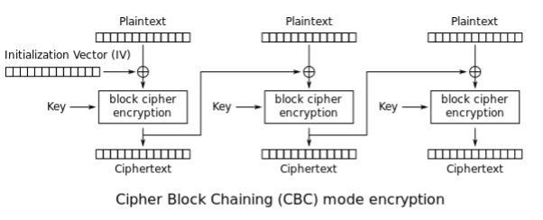

# ACIT 4630 – Lab 5 – Cryptography

**Lab Instructions :**
Please do the following tasks on the Kali VM.

## Symmetric Cryptography

### 🎯 Mission 5 – Operation Cipherstorm

#### Part I – Shadow Message (Symmetric Cryptography)

The underground network intercepted a strange file. Rumor says it hides a message only those who know the right key can uncover.

Your mission:

- Use your Kali terminal and OpenSSL to peel away the encryption.
- The algorithm, key, and IV are known (but do you know what each means?).
- Once decrypted, the truth will reveal itself — and so will the first flag.

You are given a [ciphertext.txt](../files/ciphertext.txt) (right click and select save Link As to download the text file) and asked to decrypt it using openssl enc command; or download with the commnad below:

```sh
curl 'https://codevoyage.dev/Information_Assurance_and_Security_Labs/files/ciphertext.txt' > ciphertext.txt
```

Type `openssl enc --help` on the terminal to see how you should use this command. Here's some of the info you need:

- key: `00112233445566778889aabbccddeeff`
- initialization vector (IV): `010203040506070809000a0b0c0d0e0f`
- algorithm used: `-aes-128-cbc`

Answer the following questions:

- Q1. Note the name of the algorithm. What does each part refer to (aes, 128, cbc)?
  - Watch this [YouTube Video (<2 Mins)](https://www.youtube.com/watch?v=0D7OwYp6ZEc) to understand what CBC mode is.
  - 
- Q2. What is the plaintext of the message?
- Q3. Is the provided key part of a key pair?
- Q4. Should this key be shared publicly?

## Asymmetric Cryptography

RSA (Rivest-Shamir-Adleman) is one of the first public-key cryptosystems and is widely used for secure communication. The RSA algorithm first generates two large random prime numbers and then uses them to generate public and private key pairs, which can be used to do encryption, decryption, digital signature generation, and digital signature verification.

To ensure we have the dependencies we need for the rest of the lab, Install the below package (in Kali):

```sh
sudo apt install libssl-dev
```

You need to download [rsa.c code](../files/rsa.c) on the VM and uncomment and **replace different parts of it in each of the following tasks below** or download it using the command below:

```sh
curl 'https://github.com/TheRealCodeVoyage/Information_Assurance_and_Security_Labs/raw/refs/heads/main/docs/files/rsa.c' > rsa.c
```

After **each change**, to compile the code, run the following command in the folder where the code is:

```sh
gcc -o rsa rsa.c -lcrypto
```

and then run `./rsa` to see the results.
Note: The provided C code uses **hex strings** as input and output.

- To convert an ASCII string to a hex string to use in the C code, use the following Python command

```sh
python3 -c 'print("the_ascii_string".encode("ascii").hex())'
```

- To convert a hex string back to ASCII string, use the following Python command

```sh
python3 -c 'print(bytearray.fromhex("the_HEX_string").decode())' 
```

**Note**: Imagine that  `e`  and  `d`  in the C code are Alice's **public** and **private** keys respectively.

For each task below take a screenshot of the change you made in the C code, explain your changes, and include a screenshot of the results.

### Task 1 - Encryption

Bob wants to send the message: `A top secret!` confidentially to Alice (the quotations are not included). Encrypt this message using the correct key.

- Q5. What's the ciphertext?
- Q6. Verify that it can be decrypted back to the original message.

### Task 2 - Decryption

### 🎯 Mission 5 – Operation Cipherstorm – Part II – The Vault

A ciphertext has already been delivered to Alice. Decrypt the ciphertext `c` with the correct key and convert the result back to a plain ASCII string. Within lies your **second flag**.

```plaintext
C= 
4ACE829A221D3673A0DF07392EEC479861D35D17DA73C1ACA2BE72D9AE02CD24
```

- Q7. What's the message in plain text?

### Task 3 - Signing a message

Alice has generated a signature for the following message, using SHA256 hash.

message (`m` in C code) => `"I owe you $2000."`

This command gives you the hash value (in hex) of the above message using SHA256:

```sh
echo "I owe you $2000" | sha256sum 
```

- What's the signature? Note: The hash is NOT the signature.

Please make a slight change to message `m`, such as changing $2000 to $2500, and sign the modified message.

- Q8. Compare both signatures and describe what you observe.

### Task 4 - Verifying a Signature

Bob receives a message `Launch a missile.` from Alice with a signature S (already in hex). We know that Alice used SHA256 to make the signature. Assuming the public key provided in the C code belongs to Alice, verify if this message is indeed from Alice or not.

```plaintext
S=
D96BE0AE035D94A7C88BA0FE518589717415CCBF880A1172BA48E2D014C5F0C8
```

We can generate the hash of the Bob's message using the command below:

```sh
echo "Launch a missile." | sha256sum
```

To compare 2 strings (one maybe in lowercase) in terminal you can use one of the below commands:
In Python:

```sh
python3 -c 'print("STRING1".upper() == "STRING2".upper())'
```

Or in Bash (replace `string1` and `string2`):

```sh
bash -c "[ "$(echo "string1" | tr '[:lower:]' '[:upper:]')" == "$(echo "string2" | tr '[:lower:]' '[:upper:]')" ] && echo "Match" || echo "No Match""
```

- Q9. Suppose that the signature is corrupted, such that the last byte of the signature changes from C8 to C9, i.e., there is only one bit of change. Please repeat this task and describe what will happen to the verification process.

### 📝 Submission For Lab 5

- Document your process for each task.
- Include screenshots of your modified code and outputs.
- Answer the questions in the lab above and including any required screenshots (i.e., for Tasks 1 to 4 under asymmetric cryptography)
- Submit your report to the Learning Hub in PDF format.
