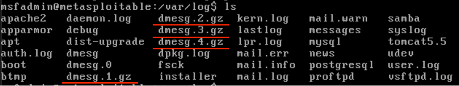

# ACIT 4630 – Lab 4 – Log Analysis

## Instructions: 
"Logs are just data... Processed and analyzed, they become information" 
We are going to use the Kali VM and the Metasploitable2 VM again in this lab. As you go through the lab, take screenshots of your commands and important results. 
Perform a port scanning from Kali to remember what services are running on what ports on Metasploitable2 VM. 

Let's explore what kind of logs exist on the Metasploitable2 machine. 
- Try an unsuccessful login to Metasploitable2 VM before starting the lab (e.g. use a wrong password) 
- (Q1) Navigate to the folder where you can see logs on the Metasploitable2 VM. What are the different log files you see there? 
- See the content of /etc/syslog.conf to understand the purpose of some of these log files. Based on the rules in this file,
    - (Q2) What kind of logs are written to syslog file? (Explain the entires you see in the conf file) 
    - (Q3) What kind of logs are written to auth.log file? (Explain the entires you see in the conf file)
        - Search for substring "failure" in this file to see the log associated with our unsuccessful login.
- (Q4) You might see some zipped files in the log folder (e.g. dmesg.1.gz,... in the following screenshot), the log rotation process generates these files.
    - What’s the purpose of log rotation? 
    

- To see the configurations for creating these different versions of a log file, see the content of this file: /etc/logrotate.conf
    - (Q5) How often are logs rotated?
    - (Q6) How many old log files are kept?
- From the folder where logs are saved, navigate to the apache2 folder.
    - (Q7) What kind of log files can you see there?
    - Examine the format of the log entries. 
- Let's clear the content of the access.log file by running the following commands, so we can monitor the new logs we are going to create.
```sh
sudo su
```
you will be prompted for the password
```sh
printf "" > path/to/access.log
```
This is writing a blank space to the file
- Now go to the Kali machine and type the IP address for the Metasploitable2 VM in a browser to visit its web server. 
- Go back to Metasploitable 2 and examine the content of access.log.
    - (Q8) What command gives you the number of log entries (lines) in this file? 
    - (Q9) Take a screenshot of the logs and identify different parts of the log entries using this table: (you'll see a hyphen - for any missing data) 
    

- Navigate to different options listed on the webpage (on Kali) and verify the log entries associated with it in access.log (on Metasploitable2) 
- Now let's generate some unhealthy traffic! On the Kali machine. Download and install [ZAP application](https://www.zaproxy.org/getting-started/) (Linux Installer). You need to set execute permission on the downloaded script.
- We'll use ZAP as a “man-in-the-middle proxy" in another lab to intercept and inspect messages sent between a browser and web application, modify the contents if needed, and then forward those packets to the destination. Today we'll use it to simulate an attack against the webserver on the Metasploitable 2 VM. 
- Go to the Quick Start tab in ZAP, select Automated Scan and enter Metasploitable 2 IP in the "URL to attack" field, and press Attack 
- Stop the attack after a few minutes and check the number of lines in access.log.
- Many connections in a short period of time (therefore a large quick increase in the number of log entries) could be an indication of a scan happening!
- We are going to use the cut command with `-d` and `-f` options to extract the client IP from each line of the log file: (examine the format of each log entry again to understand how this command works):
    ```sh
    cat access.log | cut -d " " -f 1
    ```
    - `-d` uses a delimiter to cut each line to fields separated by that delimiter
    - `-f` indicates which fields to return
- (Q10) How many IPs did you get from the previous step?
    - A large number of requests from one IP might be abnormal! 
- Use `|` to send the output of the chained commands from the previous step to `uniq -c | sort -n` to see the unique entries sorted by the number of times they appeared in the log entries. 
- (Q11) Now, update the cut command (before piping it to `uniq`) to return the timestamps as well as the IPs to see how rapid these connections from the same IP were happening. What can you learn from this data?
    - Being able to narrow a potential abnormal activity to a specific timestamp can help us correlate it with other data.
- Examine the format of the log entries again, and change the cut command to return the user-agent string from each log entry.
    - Hint: You need to use another delimiter instead of a space (`" "`) 
- To find the unique values of user-agent strings and the number of times they appeared in the log entries, use | to send the output of the chained commands from the previous step to `uniq -c | sort -n` 
- (Q12) Which user-agent has the maximum number of appearances? How can we find the IP addresses that used this user agent?
•	Hint: Use grep and cut commands

### Submission For Lab 4: 
- Create a report answering the questions in the lab above and including any required screenshots. 
- Submit your report to the Learning Hub in PDF format.

