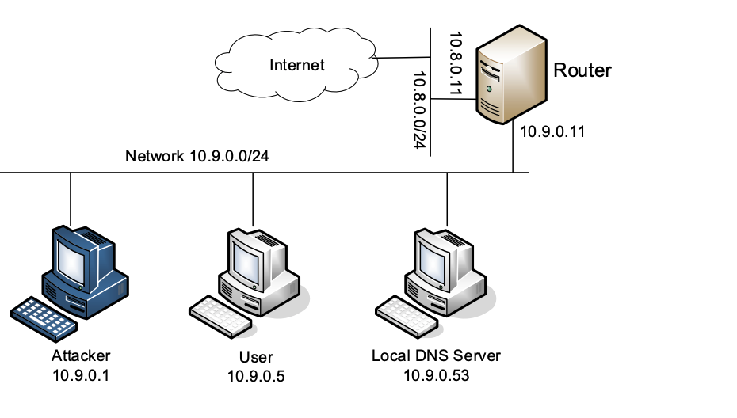
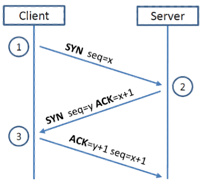

# ACIT 4630 – Lab 10 – Sniffing and Spoofing, TCP SYN Flood

## Instructions: 
Please download and unzip Lab setup files into your SEED VM (or Kali VM): 

[Labsetup-Lab-9.zip](../files/Labsetup-lab-9.zip) 

Navigate to the folder containing the `docker-compose.yml` file and run the 
following command: 
```sh
docker-compose up -d
```
to setup these machines: 



All the codes needed in the following tasks are provided in the volumes folder in the Lab setup folder. All attacks are done from the attacker's machine. 

_Take screenshots of your code snippets and important results and explain what you see._ 

### Part 1 - Sniffing and Spoofing 
Packet sniffing and spoofing are two major threats in network communication. There are many packet sniffing and spoofing tools, such as Wireshark, Tcpdump, [Scapy](https://scapy.net/), etc. Some of these tools are widely used by security experts, as well as by attackers. We will be using Scapy for sniffing and spoofing packets in the first part of the lab. 

#### Task 1.1: Sniffing Packets 

We are going to use [sniff()](https://scapy.readthedocs.io/en/latest/usage.html?highlight=sniff%20function#sniffing) function from Scapy. These 3 arguments will be used in our sample code: 
- `prn`: callback function to apply to each packet 
- `filter`: [BPF](https://www.ibm.com/docs/en/qsip/7.4?topic=queries-berkeley-packet-filters) filter to sniff only the certain types of packets 
- `iface`: interface or list of interfaces to sniff on 

Note: To see a list of all possible arguments for this function, you can run python3 command on a terminal on SEED VM to open a python shell, type `from scapy.all import *` and then type `help(sniff)` 
You need to add the correct interface name and the filter in the `sniff.py` code and run it on the attacker's container: `python3 sniff.py` (the terminal **will hang and wait** for packets to sniff) 

- To get the interface name for the container network:
    - Use `ifconfig` on the VM to list network interfaces. Look for the interface (it should start with `br-`) that's connected to 10.9.0.1 (the IP address assigned to our VM in the new network created to connect the VM and the containers) 

Demonstrate that you can sniff the intended packets on the attacker's machine (each filter should be set separately): 

Note: Packets are divided into layers (e.g. Ether, IP, UDP, RAW) in Scapy, each layer start with ###[ name of the layer]###. The payload of each layer is the consecutive layers. 

1.	Capture only ICMP packets between containers 
2.	Capture any TCP packet that comes from hostC machine and to any destination port number 23.
    - Hint: You should be able to see telnet password in the sniffed packet! 
3.	Open Wireshark and in the packets related to a telnet connection (on any other TCP connection), notice the 3-way handshake (and the flags used in the packets), and also look at seq and ack number in the packets where data has been sent. 


#### Task 1.2: Spoofing ICMP Packets 

As a packet spoofing tool, Scapy allows us to set the fields of IP packets to arbitrary values. Update the provided spoof.py code to spoof IP packets with an arbitrary source IP address (e.g. `1.2.3.4`) and send the spoofed packets to the victim machine: `python3 spoof.py`. Open Wireshark on the VM and select the interface for the container network to

1.	Q1. Is the spoofed request accepted by the receiver?
- If it is accepted, is an echo reply packet sent to the spoofed IP address?
2.	Q2. Why is this considered a "spoofed" packet?


#### Task 1.3: Sniffing and then Spoofing 

Before starting this task, run the following ping commands on
the victim's machine and notice what you observe. Open Wireshark on the VM and select the interface for the containers' network to observe the traffic when you run these commands: 

- ping 1.2.3.4 (a non-existing host on the Internet) 
- ping 8.8.8.8 (an existing host on the Internet) 
- ping 10.9.0.99 (a non-existing host on the LAN)
- You might want to review the purpose of [ARP protocol](https://www.fortinet.com/resources/cyberglossary/what-is-arp#:~:text=Address%20Resolution%20Protocol%20(ARP)%20is,%2Darea%20network%20(LAN).) 

In this task we are going to sniff any ICMP request packet sent from
the victim machine, and regardless of what the target IP address is, immediately send out an echo reply back to the victim machine using the packet spoofing technique. Update the provided `sniff-spoof.py` code to set 

- the IP source and destination of the spoofed packet (Think about how they are related to the sniffed packet) 
- the type of the ICMP packet (`echo-request` or `echo-reply`?) 
- the correct filter 
- the interface name 

Q3. Run the code on the **attacker**'s machine: `python3 sniff- spoof.py` and explain your observations when you run the following ping commands on the victim's container 

- ping 1.2.3.4 (a non-existing host on the Internet)
- ping 8.8.8.8 (an existing host on the Internet) 
- ping 10.9.0.99 (a non-existing host on the LAN) 


### Part 2 - SYN Flooding Attack 

The vulnerabilities in the TCP/IP protocols represent a special genre of vulnerabilities in protocol designs and implementations; they provide an invaluable lesson as to why security should be designed from the beginning, rather than being added as an afterthought. 

In this attack, the attacker machine is going to send many SYN requests to a victim’s telnet port (with no intention to finish the 3-way handshake procedure) to fill out the victim's queue (associated with telnet) for half-open connections: 



The size of the queue has a system-wide setting. In Ubuntu OSes, we can check the setting using the following command: 
```sh
# sysctl net.ipv4.tcp_max_syn_backlog
```
We can use the command `netstat -nat` to check the usage of the queue, i.e., the number of half-opened connections associated with a listening port. The state for such connections is SYN-RECV. If the 3-way handshake is finished, the state of the connections will be ESTABLISHED.

By default, Ubuntu’s SYN flooding countermeasure is turned on. This mechanism is called SYN cookie. It will kick in if the machine detects that it is under the SYN flooding attack. In our victim server container, we have already turned it off (see the `sysctls` entry for the victim machine in `docker-compose.yml`). 

- You could verify the value of SYN cookie flag by `sysctl -a | grep syncookies` 
- You can use the following command to turn it on and off:
- `sysctl -w net.ipv4.tcp_syncookies=0` (turn off SYN cookie)
- `sysctl -w net.ipv4.tcp_syncookies=1` (turn on SYN cookie) 

Run Wireshark on the VM and watch the traffic on the container's interface as you launch the attack from the attacker container (let it run for a few minutes)
```sh
synflood <victim's IP> <telnet port>
```
- Check for packets coming from random IPs during the attack on Wireshark. 
- Check the usage of the queue for the half-opened connections on the victim' machine: `netstat -nat `
- Q4. Explain what happens if you try to telnet from HostB to the victim's machine while the attack is running. Is the attack successful?
    - HostC will probably be able to connect to the victim's machine since before the attack it has already made a telnet connection (or TCP connection) to the victim machine. It seems that the victim machine remembers past successful connections, and uses this memory when establishing future connections with the “returning” client. This behavior does not exist in Ubuntu 16.04 and earlier versions. 
- Q5. Does SYN flooding attack cause the victim server to freeze? (Hint: use top command and look at the CPU usage and memory usage in the table) 
- Q6. Would any existing telnet session be affected by the SYN flood attack? 
- Q7. Do you think you would be able to ssh to the victim machine while it's under attack? 

Please enable the SYN cookie mechanism, and run your attacks again, and compare the results. 

Some of the instructions are copied from seedsecuritylabs.org [Sniffing and Spoofing](https://seedsecuritylabs.org/Labs_20.04/Files/Sniffing_Spoofing/Sniffing_Spoofing.pdf) and [TCP Attacks](https://seedsecuritylabs.org/Labs_20.04/Files/TCP_Attacks/)


### Submission For Lab 10: 
- Create a report answering any questions in the lab above and including any required screenshots. 
- Submit your report to the Learning Hub in PDF format. 
